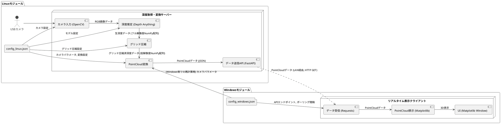
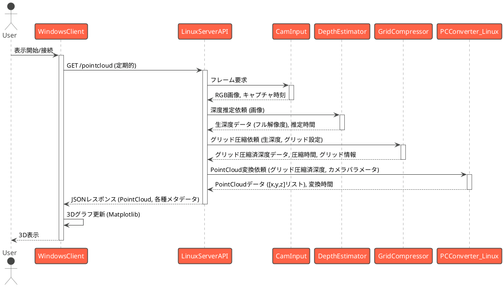

# PointCloudリアルタイム障害物検知システム仕様書

## 1. 概要

本システムは、Linuxマシンに接続されたUSBカメラから深度情報を取得し、深度マップを指定のグリッドサイズに集約（以下、「グリッド圧縮」と呼ぶ）した後、PointCloudに変換し、LAN経由でWindowsマシンに送信する。Windowsマシンでは受信したPointCloudデータをリアルタイムに3D表示し、障害物の位置を把握することを目的とする。目標処理速度は5fpsとする。

## 2. システム構成



## 3. モジュール詳細

### 3.1. Linuxモジュール

#### 3.1.1. カメラ入力 (CamInput)
-   **役割:** USBカメラから指定された解像度・フレームレートで映像フレームを取得する。
-   **使用ライブラリ:** OpenCV (`cv2`)
-   **主要処理:**
    -   `config_linux.json` からカメラデバイスID、解像度、FPSを読み込む。
    -   `cv2.VideoCapture(device_id)` でカメラデバイスを開く。
    -   `cap.set(cv2.CAP_PROP_FRAME_WIDTH, width)`、`cap.set(cv2.CAP_PROP_FRAME_HEIGHT, height)`、`cap.set(cv2.CAP_PROP_FPS, fps)` でカメラパラメータを設定。
    -   ループ内で `cap.read()` を呼び出し、RGBフレームを取得。エラー処理（フレーム取得失敗時など）を含む。

#### 3.1.2. 深度推定 (DepthEstimator)
-   **役割:** 入力されたRGB画像フレームから深度情報を推定する。
-   **ベース実装:** `depth_processor/depth_model.py` の `DepthAnythingModel` クラス（または類似のクラス）。
-   **主要処理:**
    -   `config_linux.json` からDepth Anythingモデルのパス、モデルタイプ、および推論に使用するデバイス（CPU/GPU）を読み込む。
    -   `DepthAnythingModel` のインスタンスを初期化。
    -   `model.estimate_depth(image_rgb)` メソッドを呼び出し、深度マップ（NumPy配列、例: `float32`）を取得。

#### 3.1.3. グリッド圧縮 (GridCompressor)
-   **役割:** 推定されたフル解像度の深度マップ（NumPy配列）を、指定されたグリッドサイズに集約（平均化など）し、データ量を削減する。
-   **ベース実装:** `depth_processor/depth_model.py` の `compress_depth_to_grid` 関数を参考にする。
-   **主要処理:**
    -   `config_linux.json` から目標グリッドサイズ（例: `rows: 8, cols: 6`）と集約方法（例: "mean", "median", "min", "max"）を読み込む。
    -   入力されたフル解像度深度マップを、指定されたグリッドの各セルに対応する領域に分割。
    -   各領域内の深度値を選択された方法で集約し、新しい低解像度の深度グリッド（NumPy配列）を生成。
    -   処理後のグリッドデータ、元の解像度、グリッド解像度、集約方法をAPIレスポンスに含めるための情報として保持。

#### 3.1.4. PointCloud変換 (PCConverter)
-   **役割:** グリッド圧縮された深度データとカメラ内部パラメータからPointCloudデータ（3D座標のリスト）を生成する。
-   **ベース実装:** `depth_processor/point_cloud.py` の `PointCloudConverter` クラス（または類似のクラス）。
-   **主要処理:**
    -   `config_linux.json` からカメラ内部パラメータ（焦点距離 `fx, fy`、光学中心 `cx, cy`）および深度スケールを読み込む。
    -   入力はグリッド圧縮済みの深度データ（低解像度NumPy配列）。
    -   `converter.depth_grid_to_pointcloud(depth_grid, grid_params, camera_intrinsics, depth_scale)` のようなメソッドを呼び出す。
        -   このメソッドは、各グリッドセルの深度値を、そのセルが元の画像で占める領域の中心または代表点の深度として扱い、3D座標に変換する。
        -   グリッドの各セルが元の画像のどの範囲に対応するかを考慮して、`u, v` 座標を決定する必要がある。
    -   点のリスト `[[x1,y1,z1], [x2,y2,z2], ...]` をメートル単位で取得。

#### 3.1.5. データ送信API (DataAPI)
-   **役割:** PointCloudデータをJSON形式で提供するHTTP GETエンドポイントを実装する。
-   **使用ライブラリ:** FastAPI
-   **ベース実装:** `simple_fastapi_camera.py` を参考に大幅に拡張。
-   **エンドポイント:** `GET /pointcloud`
-   **レスポンス (成功時):**
    ```json
    {
      "timestamp_api": 1678886400.12345, // APIがレスポンスを生成した時刻 (Unixタイムスタンプ)
      "timestamp_capture": 1678886400.05000, // カメラがフレームをキャプチャしたおおよその時刻
      "original_depth_shape": [480, 640], // グリッド圧縮前の深度データの形状
      "grid_compression": {
        "method": "mean", // "mean", "median", "min", "max"
        "grid_rows": 8,
        "grid_cols": 6
      },
      "point_cloud_from_grid": true, // PointCloudがグリッドデータから生成されたことを示すフラグ
      "points_count": 48, // grid_rows * grid_cols
      "points": [ // x, y, z はメートル単位
        // [0.10, 0.20, 1.50],
        // [0.15, 0.22, 1.60],
        // ... 他の点 (グリッドの各セルに対応)
      ],
      "depth_estimation_time_ms": 120.2,
      "grid_compression_time_ms": 5.1,
      "point_cloud_generation_time_ms": 2.5
    }
    ```
-   **主要処理:**
    -   FastAPIアプリケーションを定義。
    -   `/pointcloud` ルートで、カメラ入力→深度推定→グリッド圧縮→PointCloud変換の一連の処理を非同期（`async def`）で実行。
    -   各処理ステップの時間を計測し、レスポンスに含める。
    -   処理結果をJSONで返す。

### 3.2. Windowsモジュール

#### 3.2.1. データ受信 (DataReceiver)
-   **役割:** Linuxモジュールの `/pointcloud` APIに定期的にアクセスし、PointCloudデータを取得する。
-   **使用ライブラリ:** `requests`
-   **主要処理:**
    -   `config_windows.json` からLinuxサーバーのIPアドレス、ポート、APIエンドポイント、ポーリング間隔、リクエストタイムアウトを読み込む。
    -   指定された間隔で `requests.get(url, timeout=timeout_seconds)` を呼び出す。
    -   受信したJSONデータをパースする。
    -   レスポンス内の `points` フィールドを直接使用してPointCloudデータとして扱う。
    -   エラーハンドリング（接続エラー、タイムアウト、不正なJSONレスポンス）。

#### 3.2.2. PointCloud表示 (PCVisualizer)
-   **役割:** 受信・処理したPointCloudデータをMatplotlibを使用して3D空間にリアルタイム描画する。
-   **使用ライブラリ:** Matplotlib (`mpl_toolkits.mplot3d`)
-   **ベース実装:** `visualize_csv_depth_data.py` の3D散布図表示ロジックを参考にする。
-   **主要処理:**
    -   Matplotlibの3Dプロットエリア (`Axes3D`) を準備。
    -   `matplotlib.animation.FuncAnimation` を使用して、データ受信ごとにプロットを更新。
    -   `ax.scatter()` で点を描画。パフォーマンス向上のため、`scatter.set_offsets()` で既存の点のデータを更新する。点の数が大きく変動する場合は `cla()` して再描画。
    -   `config_windows.json` から表示範囲（X, Y, Zの最小/最大値）、点のサイズ、色などを設定可能にする。
    -   軸ラベル (`X [m]`, `Y [m]`, `Z [m]`)、タイトル（例: "Real-time Point Cloud"）を設定。

#### 3.2.3. UI (WinUI)
-   **役割:** Matplotlibの描画ウィンドウを管理し、ユーザーへの情報表示を行う。
-   **主要処理:**
    -   Matplotlibのウィンドウが主要UI。
    -   ウィンドウタイトルに接続状況、受信ポイント数、FPS（実測値）などのステータス情報を表示。
    -   （オプション）簡単な操作ボタン（接続/切断、視点リセットなど）をMatplotlibのウィジェットで追加。

## 4. シーケンス図

### 4.1. データ処理フロー (Linuxサーバー起動後、Windowsクライアント接続)



## 5. データフォーマットと設定ファイル

### 5.1. PointCloudデータ (JSON)
-   「3.1.5. データ送信API (DataAPI)」のレスポンス形式を参照。

### 5.2. 設定ファイル

#### 5.2.1. Linux側 (`config_linux.json`)
```json
{
  "camera": {
    "device_id": 0,
    "width": 640,
    "height": 480,
    "fps": 10
  },
  "depth_model": {
    "model_path": "models/depth_anything_vitl14.pth", // 例: /path/to/your/model.pth
    "model_type": "vitl", // Depth Anythingのモデルタイプ (e.g., vits, vitb, vitl)
    "device": "cuda" // 推論に使用するデバイス "cuda" または "cpu"
  },
  "grid_compression": {
    "enabled": true,
    "target_rows": 8, // グリッドの行数
    "target_cols": 6, // グリッドの列数
    "method": "mean" // "mean", "median", "min", "max"
  },
  "point_cloud": {
    "camera_intrinsics": {
      "fx": 525.0, // 例: TUM RGB-D datasetの一般的な値
      "fy": 525.0, 
      "cx": 319.5, 
      "cy": 239.5
    },
    "depth_scale": 1000.0 // 深度値がmm単位で提供される場合、メートルに変換するためのスケール (1.0ならメートル単位)
    // "downsample_factor" は grid_compression に置き換え
  },
  "api_server": {
    "host": "0.0.0.0",
    "port": 8000
  }
}
```

#### 5.2.2. Windows側 (`config_windows.json`)
```json
{
  "server": {
    "host": "192.168.1.100", // Linuxサーバーの実際のIPアドレスに置き換えてください
    "port": 8000,
    "endpoint": "/pointcloud"
  },
  "client": {
    "polling_interval_ms": 200,
    "request_timeout_s": 1.0
  },
  "visualization": {
    "plot_limit_x_m": [-2.0, 2.0],
    "plot_limit_y_m": [-2.0, 2.0],
    "plot_limit_z_m": [0.1, 5.0],
    "point_size": 5, // グリッド表示なので少し大きめにするなど調整
    "point_color": "green"
  }
  // "point_cloud_processing" セクションは、Linux側でPointCloudまで生成するため、
  // Windows側での再計算が不要な場合は削除またはコメントアウト可能。
  // もしWindows側でグリッドデータから再計算するオプションを残す場合は以下のようにする。
  /*
  "point_cloud_processing": {
     "enabled": false, // trueの場合、受信したグリッドデータから再計算
     "camera_intrinsics": { // Linux側の設定と一致させる
      "fx": 525.0, 
      "fy": 525.0, 
      "cx": 319.5, 
      "cy": 239.5
    },
    "depth_scale": 1000.0
  }
  */
}
```

## 6. 通信プロトコル
-   HTTP/1.1 (FastAPIデフォルト)

## 7. 性能目標と対策
-   **目標:** エンドツーエンドでの処理速度 5fps以上。
-   **ボトルネック候補と対策:**
    1.  **深度推定 (Linux):** (変更なし)
        // ...existing code...
    2.  **グリッド圧縮 (Linux):**
        -   NumPyの効率的なスライス、リシェイプ、集約関数を使用。
        -   グリッドサイズが大きすぎると効果が薄れ、小さすぎると情報損失が大きい。適切なバランスを見つける。
    3.  **データ転送 (Network):**
        -   グリッド圧縮により、送信する点の数が大幅に削減されるため、JSONのオーバーヘッドの影響は相対的に小さくなる。
        -   フル解像度の深度マップを送信するよりは軽量。
    4.  **Python GIL (Linux/Windows):** (変更なし)
        // ...existing code...
    5.  **Matplotlib描画 (Windows):**
        -   表示する点数がグリッドサイズに依存するため、フル解像度の場合よりは負荷が低い。
        -   `set_offsets()` や `set_data()` を使用した効率的な更新。
        -   表示点数の上限設定。
        -   より高速な描画ライブラリ（VisPy, PyVista, PyQtGraph）への移行検討（複雑度増）。

## 8. 実装方針と既存機能の活用

-   **Linux側** (`linux_main.py` のようなエントリスクリプトを想定):
    -   `config_linux.json` を読み込むユーティリティ関数。
    -   カメラ入力: `cv2.VideoCapture` を使用するクラス/関数。
    -   深度推定: `depth_processor/depth_model.py` を改修。`config_linux.json` に基づきモデルとデバイスを初期化。
    -   グリッド圧縮: `depth_processor/depth_model.py` の `compress_depth_to_grid` 関数を使用。
    -   PointCloud変換: `depth_processor/point_cloud.py` を改修。`config_linux.json` からカメラパラメータをロード。圧縮データ解凍ロジックもここかAPI層で持つ。
    -   APIサーバー: `simple_fastapi_camera.py` を大幅に拡張し、上記処理を統合した `/pointcloud` エンドポイントを作成。各処理時間を計測。
-   **Windows側** (`windows_client.py` のようなエントリスクリプトを想定):
    -   `config_windows.json` を読み込むユーティリティ関数。
    -   データ取得: `requests` ライブラリを使用し、定期ポーリングするクラス/関数。
    -   データ処理: 受信データが圧縮されている場合、解凍し、`depth_processor/point_cloud.py` の関連機能（または移植版）でPointCloudに変換。
    -   PointCloud表示: `visualize_csv_depth_data.py` のMatplotlib 3D表示ロジックをベースに、`FuncAnimation` を用いてリアルタイム更新に対応するクラス。

## 9. エラーハンドリングとログ出力

-   **エラーハンドリング:**
    -   Linux側API: カメラ接続失敗、モデルロード失敗、処理タイムアウト、予期せぬ例外などを捕捉し、適切なHTTPステータスコードとエラーメッセージをJSONで返す。
    -   Windowsクライアント: サーバー接続失敗、タイムアウト、不正なデータ受信、解凍/変換エラーなどを検出し、UI（コンソールやウィンドウタイトル）に通知。リトライ処理も検討。
-   **ログ出力:**
    -   両プラットフォームで `logging` モジュールを使用。
    -   Linux側: APIリクエスト受信、各処理ステップの開始/終了、処理タイム、エラー詳細などをファイルおよびコンソールに出力。ログレベル設定可能。
    -   Windows側: 接続試行、成功、失敗、受信データ概要、FPS、エラー詳細などをファイルおよびコンソールに出力。

## 10. 今後の課題・拡張性
-   **リアルタイム性向上:**
    -   UDP通信の検討（信頼性より速度重視の場合）。
    -   より効率的なバイナリデータ転送フォーマットの採用。
-   **機能拡張:**
    -   障害物検知アルゴリズムの統合（例: 特定距離内の点群クラスタリング、地面除去）。
    -   カメラパラメータのオンラインキャリブレーション機能。
    -   Windows側での表示設定（色、サイズ、表示範囲など）の動的変更UI。
-   **堅牢性向上:**
    -   詳細な単体テスト、結合テストの作成。
    -   設定ファイルのバリデーション強化。
