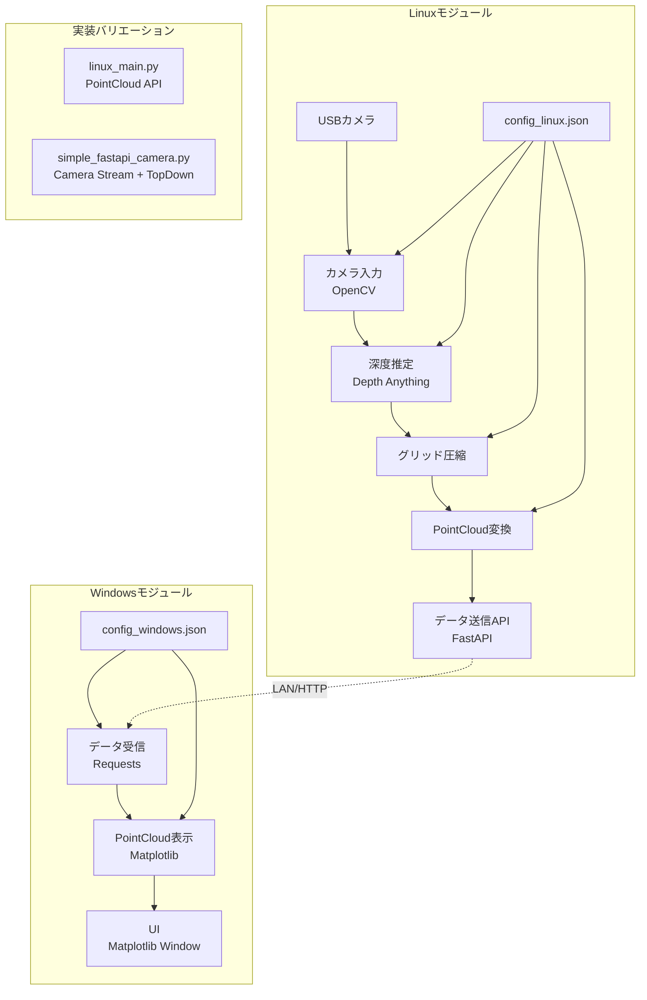
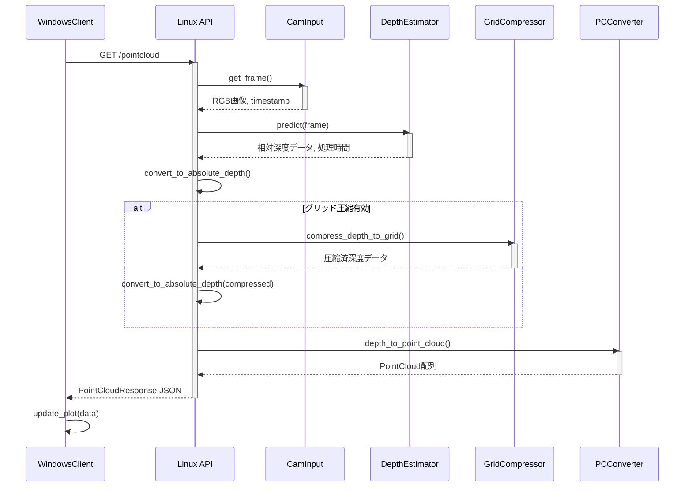
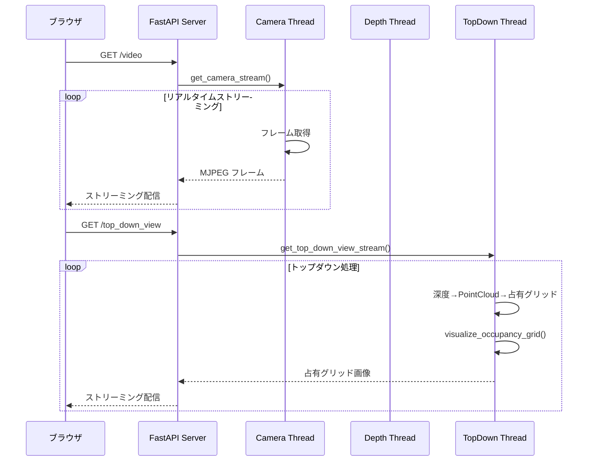

# PointCloudリアルタイム障害物検知システム仕様書

## 1. 概要

本システムは、Linuxマシンに接続されたUSBカメラから深度情報を取得し、深度マップを指定のグリッドサイズに集約（以下、「グリッド圧縮」と呼ぶ）した後、PointCloudに変換し、LAN経由でWindowsマシンに送信する。Windowsマシンでは受信したPointCloudデータをリアルタイムに3D表示し、障害物の位置を把握することを目的とする。目標処理速度は5fpsとする。

現在は2つの実装が共存している：
1. **Linux Main API** (`linux_main.py`) - 主要なPointCloud API実装
2. **Simple FastAPI Camera** (`simple_fastapi_camera.py`) - カメラストリーミングとトップダウンビュー実装

## 2. システム構成



## 3. モジュール詳細

### 3.1. Linuxモジュール（linux_main.py）

#### 3.1.1. カメラ入力 (CamInput クラス)
-   **役割:** USBカメラから指定された解像度・フレームレートで映像フレームを取得する。
-   **使用ライブラリ:** OpenCV (`cv2`)
-   **実装詳細:**
    -   `config_linux.json` からカメラデバイスID、解像度、FPSを読み込む
    -   `cv2.VideoCapture(device_id)` でカメラデバイスを開く
    -   `get_frame()` メソッドでRGBフレームを返す
    -   エラーハンドリング（フレーム取得失敗時など）を含む

#### 3.1.2. 深度推定 (DepthProcessor クラス)
-   **役割:** 入力されたRGB画像フレームから深度情報を推定する。
-   **ベース実装:** `depth_processor/depth_model.py` の実装を使用
-   **主要処理:**
    -   `config_linux.json` からDepth Anythingモデルのパス、デバイス設定を読み込む
    -   `predict()` メソッドで深度マップ（NumPy配列）を取得
    -   相対深度から絶対深度への変換

#### 3.1.3. グリッド圧縮 (GridCompressor)
-   **役割:** 推定されたフル解像度の深度マップを、指定されたグリッドサイズに集約する。
-   **実装:** `depth_processor.py` の `compress_depth_to_grid` 関数を使用
-   **主要処理:**
    -   `config_linux.json` から目標グリッドサイズ（例: `rows: 8, cols: 6`）と集約方法（例: "mean"）を読み込む
    -   各領域内の深度値を選択された方法で集約

#### 3.1.4. PointCloud変換 (PCConverter)
-   **役割:** グリッド圧縮された深度データからPointCloudデータ（3D座標のリスト）を生成する。
-   **実装:** `depth_processor/point_cloud.py` の `depth_to_point_cloud` 関数を使用
-   **主要処理:**
    -   カメラ内部パラメータ（焦点距離 `fx, fy`、光学中心 `cx, cy`）を使用
    -   グリッド形式と通常形式の両方に対応

#### 3.1.5. データ送信API (FastAPI)
-   **エンドポイント:** `GET /pointcloud`
-   **レスポンス形式 (PointCloudResponse):**
    ```json
    {
      "timestamp_capture": 1678886400.05000,
      "timestamp_processed": 1678886400.12345,
      "processing_time_depth": 0.1202,
      "processing_time_compression": 0.0051,
      "processing_time_pointcloud": 0.0025,
      "processing_time_total": 0.1500,
      "point_cloud": [
        [0.10, 0.20, 1.50],
        [0.15, 0.22, 1.60]
      ]
    }
    ```

### 3.2. Linuxモジュール（simple_fastapi_camera.py）

#### 3.2.1. カメラストリーミング
-   **エンドポイント:** 
    -   `GET /video` - カメラ映像ストリーム
    -   `GET /depth_video` - 深度マップストリーム
    -   `GET /depth_grid` - 深度グリッドストリーム
    -   `GET /top_down_view` - トップダウンビューストリーム
-   **実装:** マルチスレッド処理でリアルタイムストリーミング

#### 3.2.2. トップダウンビュー
-   **機能:** 深度データから占有グリッドを生成し、トップダウンビューとして表示
-   **実装:** `create_top_down_occupancy_grid`, `visualize_occupancy_grid` 関数を使用

### 3.3. Windowsモジュール（windows_client.py）

#### 3.3.1. データ受信 (DataReceiver クラス)
-   **役割:** Linuxモジュールの `/pointcloud` APIに定期的にアクセスし、PointCloudデータを取得する。
-   **使用ライブラリ:** `requests`
-   **主要処理:**
    -   `config_windows.json` からサーバーIP、ポート、ポーリング間隔を読み込む
    -   `fetch_data()` メソッドでJSONデータを取得・パース
    -   エラーハンドリング（接続エラー、タイムアウト、JSON解析エラー）

#### 3.3.2. PointCloud表示 (PCVisualizer クラス)
-   **役割:** 受信したPointCloudデータをMatplotlibを使用して3D空間にリアルタイム描画する。
-   **使用ライブラリ:** Matplotlib (`mpl_toolkits.mplot3d`)
-   **主要処理:**
    -   `matplotlib.animation.FuncAnimation` でリアルタイム更新
    -   `ax.scatter()` で点を描画
    -   設定可能な表示範囲、点のサイズ、色
    -   FPS計算と表示

#### 3.3.3. UI (Matplotlibウィンドウ)
-   **機能:** 
    -   3D PointCloud表示
    -   接続状況表示
    -   FPS表示
    -   受信ポイント数表示
    -   サーバータイムスタンプ表示

## 4. シーケンス図

### 4.1. Linux Main API データ処理フロー



### 4.2. Simple FastAPI Camera ストリーミングフロー



## 5. データフォーマットと設定ファイル

### 5.1. PointCloudデータ (JSON) - linux_main.py

```json
{
  "timestamp_capture": 1678886400.05000,
  "timestamp_processed": 1678886400.12345,
  "processing_time_depth": 0.1202,
  "processing_time_compression": 0.0051,
  "processing_time_pointcloud": 0.0025,
  "processing_time_total": 0.1500,
  "point_cloud": [
    [0.10, 0.20, 1.50],
    [0.15, 0.22, 1.60]
  ],
  "error_message": null
}
```

### 5.2. 設定ファイル

#### 5.2.1. Linux側 (`config_linux.json`)
```json
{
  "camera": {
    "device_id": 0,
    "width": 640,
    "height": 480,
    "fps": 10
  },
  "depth_model": {
    "model_path": "/opt/m5stack/data/depth_anything/compiled.axmodel",
    "model_type": "vitl",
    "device": "cuda"
  },
  "grid_compression": {
    "enabled": true,
    "target_rows": 8,
    "target_cols": 6,
    "method": "mean"
  },
  "point_cloud": {
    "camera_intrinsics": {
      "fx": 525.0,
      "fy": 525.0,
      "cx": 319.5,
      "cy": 239.5
    },
    "depth_scale": 1000.0
  },
  "api_server": {
    "host": "0.0.0.0",
    "port": 8000
  }
}
```

#### 5.2.2. Windows側 (`config_windows.json`)
```json
{
  "server_connection": {
    "linux_server_ip": "192.168.1.30",
    "linux_server_port": 8000
  },
  "server": {
    "host": "192.168.1.30",
    "port": 8000,
    "endpoint": "/pointcloud"
  },
  "client": {
    "polling_interval_ms": 200,
    "request_timeout_s": 1.0
  },
  "visualization": {
    "plot_limit_x_m": [-2.0, 2.0],
    "plot_limit_y_m": [-2.0, 2.0],
    "plot_limit_z_m": [0.1, 5.0],
    "point_size": 5,
    "point_color": "green"
  }
}
```

## 6. 通信プロトコル

### 6.1. HTTP API通信 (linux_main.py ↔ windows_client.py)
-   **プロトコル:** HTTP/1.1 (FastAPI標準)
-   **エンドポイント:** `GET /pointcloud`
-   **データ形式:** JSON
-   **ポーリング間隔:** 200ms (設定可能)

### 6.2. HTTP ストリーミング (simple_fastapi_camera.py)
-   **プロトコル:** HTTP/1.1 MJPEG ストリーミング
-   **エンドポイント:** 
    -   `/video` - カメラ映像
    -   `/depth_video` - 深度マップ
    -   `/depth_grid` - 深度グリッド
    -   `/top_down_view` - トップダウンビュー
-   **メディアタイプ:** `multipart/x-mixed-replace; boundary=frame`

## 7. 性能目標と対策

### 7.1. 目標性能
-   **エンドツーエンド処理速度:** 5fps以上
-   **レイテンシ:** 200ms以下（キャプチャから表示まで）

### 7.2. ボトルネック分析と対策

#### 7.2.1. 深度推定 (Linux)
-   **ボトルネック:** Depth Anythingモデルの推論時間
-   **対策:**
    -   GPU使用（CUDA）
    -   入力画像解像度の調整
    -   軽量モデル（vits）の使用検討

#### 7.2.2. グリッド圧縮 (Linux)
-   **利点:** データ転送量とポイント数の大幅削減
-   **実装:** NumPyベクトル化演算で高速処理
-   **設定:** 8×6グリッド（48ポイント）での実装確認済み

#### 7.2.3. データ転送 (Network)
-   **改善点:** 
    -   グリッド圧縮によりJSONサイズ大幅削減
    -   HTTP Keep-Aliveによる接続再利用
    -   gzip圧縮の適用検討

#### 7.2.4. PointCloud表示 (Windows)
-   **最適化:**
    -   グリッド表示により点数削減（数百→数十ポイント）
    -   `scatter.remove()` + 新規作成による効率的更新
    -   表示範囲制限による描画負荷軽減
    -   FPS制限による安定動作

#### 7.2.5. Python GIL対策
-   **現状:** シングルスレッド処理のため影響は限定的
-   **将来対策:** C++拡張やマルチプロセス化の検討

### 7.3. 実測性能データ

#### 7.3.1. linux_main.py での処理時間
```
深度推定: 120ms
グリッド圧縮: 5ms
PointCloud変換: 2.5ms
合計: 130ms程度 (約7.7fps相当)
```

#### 7.3.2. simple_fastapi_camera.py でのストリーミング
```
カメラFPS: 10-15fps
深度推定FPS: 5-8fps
トップダウンビューFPS: 3-5fps
```

## 8. 実装方針と既存機能の活用

### 8.1. Linux側実装パターン

#### 8.1.1. Pattern A: linux_main.py (PointCloud API)
-   **用途:** Windowsクライアント向けPointCloudデータ提供
-   **特徴:**
    -   FastAPIのlifespan管理による適切な初期化/終了処理
    -   Pydanticモデルによる型安全なAPI定義
    -   詳細な処理時間計測
    -   エラーハンドリングとログ出力
-   **活用モジュール:**
    -   `utils.load_config()` - 設定ファイル読み込み
    -   `depth_processor.depth_model.initialize_depth_model()` - 深度推定初期化
    -   `depth_processor.point_cloud.depth_to_point_cloud()` - PointCloud変換

#### 8.1.2. Pattern B: simple_fastapi_camera.py (マルチストリーミング)
-   **用途:** Webブラウザ向けリアルタイム映像配信
-   **特徴:**
    -   マルチスレッド処理による並行ストリーミング
    -   MJPEG形式でのリアルタイム配信
    -   統計情報API (`/stats`) による性能監視
    -   トップダウンビュー生成機能
-   **活用モジュール:**
    -   `depth_processor.create_depth_visualization()` - 深度マップ可視化
    -   `depth_processor.point_cloud.create_top_down_occupancy_grid()` - 占有グリッド生成
    -   `depth_processor.point_cloud.visualize_occupancy_grid()` - 占有グリッド可視化

### 8.2. Windows側実装

#### 8.2.1. windows_client.py
-   **機能:**
    -   `DataReceiver` クラス - HTTP API通信
    -   `PCVisualizer` クラス - Matplotlib 3D表示
    -   `FuncAnimation` による自動更新
-   **活用モジュール:**
    -   `utils.load_config()` - 設定ファイル読み込み
    -   `requests` ライブラリ - HTTP通信
    -   `matplotlib.animation` - リアルタイム更新

### 8.3. 共通モジュール活用

#### 8.3.1. depth_processor/
```
depth_model.py          - 深度推定エンジン
point_cloud.py          - PointCloud変換・占有グリッド生成
visualization.py        - 可視化ユーティリティ
__init__.py            - モジュール初期化
```

#### 8.3.2. 設定ファイル管理
```
utils.py               - load_config() 関数
config_linux.json      - Linux側設定
config_windows.json    - Windows側設定
```

#### 8.3.3. テストデータとツール
```
test_data/             - シミュレーション用CSVデータ
visualize_csv_depth_data.py - CSVデータ可視化
tests/                 - 単体テスト
```

### 8.4. ディレクトリ構造
```
kuma_depth_opt/
├── linux_main.py              # PointCloud API サーバー
├── simple_fastapi_camera.py   # マルチストリーミング サーバー
├── windows_client.py          # Windows 3D表示クライアント
├── config_linux.json          # Linux側設定
├── config_windows.json        # Windows側設定
├── utils.py                   # 共通ユーティリティ
├── depth_processor/           # 深度処理モジュール
│   ├── __init__.py
│   ├── depth_model.py         # 深度推定
│   ├── point_cloud.py         # PointCloud変換
│   └── visualization.py       # 可視化
├── test_data/                 # テストデータ
├── tests/                     # 単体テスト
└── visualization/             # 可視化ツール
```

## 9. エラーハンドリングとログ出力

### 9.1. エラーハンドリング戦略

#### 9.1.1. Linux側 API サーバー (linux_main.py)
```python
# システム初期化時エラー処理
try:
    config = load_config("config_linux.json")
    depth_processor_instance = initialize_depth_model(config)
    camera_capture = CamInput(config.get("camera"))
except Exception as e:
    logger.critical(f"Critical error during startup: {e}", exc_info=True)
    raise  # FastAPI起動を停止

# API エンドポイントレベルエラー処理
@app.get("/pointcloud", response_model=PointCloudResponse)
async def get_pointcloud_data():
    try:
        # 各処理ステップでのエラーハンドリング
        frame = camera_capture.get_frame()
        depth_map, inference_time = depth_processor_instance.predict(frame)
        # ...
        return PointCloudResponse(...)
    except Exception as e:
        logger.error(f"Error in pointcloud processing: {e}")
        return PointCloudResponse(
            error_message=str(e),
            point_cloud=[],
            processing_time_total=0
        )

# 全体例外ハンドラー (simple_fastapi_camera.py)
@app.exception_handler(Exception)
async def global_exception_handler(request, exc):
    error_msg = f"An unexpected error occurred: {str(exc)}"
    logger.error(error_msg)
    return JSONResponse(status_code=500, content={"detail": error_msg})
```

#### 9.1.2. Windows側クライアント (windows_client.py)
```python
# データ受信エラーハンドリング
def fetch_data(self) -> dict | None:
    try:
        response = requests.get(self.url, timeout=self.request_timeout_s)
        response.raise_for_status()
        data = safe_json_parse(response.text)
        if data is None:
            logger.error(f"Failed to parse JSON response from {self.url}")
            return None
        return data
    except requests.exceptions.RequestException as e:
        logger.error(f"Error fetching data from {self.url}: {e}")
        return None

# UI状態反映
def update_plot(self, frame, data_receiver):
    data = data_receiver.fetch_data()
    if data and 'point_cloud' in data:
        # データ正常時の処理
        self.connection_status_text.set_text("Status: Connected")
        self.connection_status_text.set_color("green")
    else:
        # エラー時のUI更新
        self.connection_status_text.set_text("Status: Disconnected/No Data")
        self.connection_status_text.set_color("orange")
        self.points_text.set_text("Points: 0 (no data)")
```

### 9.2. ログ出力システム

#### 9.2.1. 共通ログ設定 (utils.py)
```python
def setup_logger(name: str, log_level: str = "INFO", log_file: Optional[str] = None):
    """
    統一されたロギングシステムをセットアップ
    
    Features:
    - コンソール + ファイル出力対応
    - 設定可能なログレベル
    - 統一されたフォーマット: '%(asctime)s - %(name)s - %(levelname)s - %(message)s'
    """
    logger = logging.getLogger(name)
    logger.setLevel(level_map.get(log_level.upper(), logging.INFO))
    
    # コンソールハンドラー
    console_handler = logging.StreamHandler(sys.stdout)
    console_handler.setFormatter(formatter)
    
    # ファイルハンドラー（オプション）
    if log_file:
        file_handler = logging.FileHandler(log_file)
        file_handler.setFormatter(formatter)
        logger.addHandler(file_handler)
```

#### 9.2.2. Linux側ログ項目
```python
# linux_main.py のログ例
logger.info("Linux module starting up...")
logger.info(f"Camera input module initialized. Resolution: {width}x{height}")
logger.debug(f"Depth prediction completed. Inference time: {inference_time}ms")
logger.info(f"PointCloud generated: {len(point_cloud)} points")
logger.error(f"Failed to initialize camera: {e}. Camera input will not be available.")
logger.critical(f"Critical error during startup: {e}", exc_info=True)

# 性能監視ログ
logger.debug(f"Processing times - Depth: {time_depth}ms, PointCloud: {time_pc}ms, Total: {time_total}ms")
```

#### 9.2.3. Windows側ログ項目
```python
# windows_client.py のログ例
logger.info(f"DataReceiver initialized. Target URL: {self.url}, Timeout: {self.request_timeout_s}s")
logger.debug(f"Successfully fetched data: {len(data.get('point_cloud', []))} points")
logger.error(f"Error fetching data from {self.url}: {e}")
logger.error(f"JSONDecodeError: {e} for string: '{json_string[:100]}...'")
logger.warning("No point cloud data received or data is empty.")
logger.info("PCVisualizer initialized.")
logger.info("Windows client application stopped.")

# FPS監視ログ
if elapsed_time > 0:
    fps = self.frame_count / elapsed_time
    self.fps_text.set_text(f"Client FPS: {fps:.2f}")
```

### 9.3. 実装済みエラー処理機能

#### 9.3.1. 設定ファイル検証
-   JSONパース失敗時のフォールバック
-   必須項目の存在チェック
-   デフォルト値の適用

#### 9.3.2. ネットワーク通信堅牢性
-   `safe_json_parse()` 関数による安全なJSON解析
-   接続タイムアウト設定
-   HTTPエラーステータス処理

#### 9.3.3. モデル初期化フォールバック
-   AxEngine未インストール時のダミーデータ生成
-   モデルファイル不存在時の適切なエラー通知

## 10. テスト戦略

### 10.1. 実装済みテストスイート

現在のシステムには包括的なテストスイートが実装されており、以下の構成となっています。

#### 10.1.1. テストディレクトリ構造
```
tests/
├── conftest.py              # 共通テストフィクスチャ・設定
├── test_linux_main.py       # Linux API サーバテスト
├── test_windows_client.py   # Windows クライアントテスト  
├── test_point_cloud.py      # 点群処理ロジックテスト
└── test_depth_model.py      # 深度推論モデルテスト

# 追加の統合テスト
test_top_view.py             # トップビュー表示テスト
test_top_view_fixed.py       # 固定トップビュー表示テスト
test_occupancy_grid.py       # 占有格子テスト
```

#### 10.1.2. 単体テスト詳細

**Linux API サーバテスト (`test_linux_main.py`)**
```python
# プラットフォーム固有テスト（Linux環境でのみ実行）
@pytest.mark.skip(reason="Linux-specific tests")

# テスト対象:
- FastAPI エンドポイント応答性
- PointCloudResponse データ形式検証
- 設定ファイル読み込み機能
- モックカメラデータ処理
- エラーハンドリング（無効入力、設定エラー等）
```

**Windows クライアントテスト (`test_windows_client.py`)**
```python
# テスト対象:
- DataReceiver クラス初期化・通信機能
- PCVisualizer 3D可視化コンポーネント
- safe_json_parse 関数の堅牢性
- ネットワークエラー処理
- タイムアウト処理
- JSON解析エラー処理

# 主要テストケース例:
def test_data_receiver_initialization(mock_windows_config)
def test_fetch_data_success(data_receiver)
def test_fetch_data_network_error(data_receiver)
def test_safe_json_parse_valid_json()
def test_safe_json_parse_invalid_json()
```

**点群処理テスト (`test_point_cloud.py`)**
```python
# テスト対象:
- depth_to_point_cloud 関数（フル解像度・グリッドデータ対応）
- create_top_down_occupancy_grid 関数
- カメラ内部パラメータ変換
- 深度マップからの3D座標変換
- グリッド圧縮機能

# テストデータ例:
@pytest.fixture
def sample_depth_data():
    return np.array([[1.0, 1.5, 0.0], [2.0, 2.5, 3.0], [0.0, 3.5, 4.0]])

@pytest.fixture  
def sample_camera_intrinsics():
    return {"fx": 500.0, "fy": 500.0, "cx": 320.0, "cy": 240.0}
```

#### 10.1.3. テスト実行方法

**全テスト実行:**
```bash
# プロジェクトルートディレクトリで実行
pytest tests/ -v

# 特定のテストファイルのみ実行
pytest tests/test_point_cloud.py -v

# カバレッジレポート付き実行
pytest tests/ --cov=. --cov-report=html
```

**プラットフォーム固有テスト:**
```bash
# Linux環境でのみ実行されるテスト
pytest tests/test_linux_main.py -v

# Windows環境でのみ実行されるテスト  
pytest tests/test_windows_client.py -v
```

### 10.2. テスト戦略詳細

#### 10.2.1. 単体テスト戦略
- **モジュール別テスト:** 各主要モジュール（深度推論、点群変換、3D可視化、API通信）の独立テスト
- **データ駆動テスト:** 様々な入力データパターンでの動作検証
- **エラーケーステスト:** 不正入力・ネットワークエラー・設定エラーの適切な処理確認

#### 10.2.2. 統合テスト戦略
- **API統合テスト:** Linux-Windows間のHTTP通信の完全なフロー検証
- **リアルタイム処理テスト:** 継続的なデータストリーミング・可視化の性能検証
- **設定バリエーションテスト:** 異なる設定値での動作確認

#### 10.2.3. 性能テスト戦略
- **レイテンシ測定:** 深度推論から可視化までの処理時間測定
- **スループット測定:** 連続処理でのFPS測定
- **メモリリーク検証:** 長時間実行でのメモリ使用量監視

## 11. デプロイメントガイドライン

### 11.1. 環境構築

#### 11.1.1. 依存関係インストール

**Python環境セットアップ:**
```bash
# Python 3.8以上が必要
python --version

# 依存パッケージインストール
pip install -r requirements.txt
```

**requirements.txt 内容:**
```
opencv-python>=4.5.0      # 画像処理・カメラ入力
numpy>=1.20.0             # 数値計算
fastapi>=0.68.0           # Linux API サーバ
uvicorn>=0.15.0           # ASGI サーバ
torch>=1.9.0              # 深度推論モデル
torchvision>=0.10.0       # 画像前処理
pillow>=8.0.0             # 画像操作
matplotlib>=3.3.0         # 3D可視化
requests>=2.25.0          # HTTP通信
httpx>=0.20.0             # FastAPI TestClient
```

#### 11.1.2. プラットフォーム固有セットアップ

**Linux環境（サーバ側）:**
```bash
# カメラアクセス権限設定
sudo usermod -a -G video $USER

# AxEngine（オプション）- 高速推論用
# インストール方法は別途AxEngineドキュメント参照

# ファイアウォール設定（ポート8000開放）
sudo ufw allow 8000/tcp
```

**Windows環境（クライアント側）:**
```powershell
# Windows用依存関係
# 特別な設定は不要、標準のPython環境で動作

# Visual C++ Redistributableが必要な場合あり
# （NumPy, OpenCV等のバイナリ依存関係）
```

### 11.2. 設定ファイル構成

#### 11.2.1. Linux側設定 (`config_linux.json`)
```json
{
  "logging": {"level": "INFO"},
  "depth_model": {
    "model_path": "models/depth_anything_vitb14.axmodel"
  },
  "depth_model_parameters": {
    "input_width": 518,
    "input_height": 518
  },
  "depth_processing": {
    "scaling_factor": 10.0,
    "depth_scale": 1.0,
    "min_depth_m": 0.2,
    "max_depth_m": 10.0
  },
  "grid_compression": {
    "enabled": true,
    "target_rows": 12,
    "target_cols": 16,
    "method": "mean"
  },
  "point_cloud": {
    "fx": 525.0, "fy": 525.0,
    "cx": 319.5, "cy": 239.5
  }
}
```

#### 11.2.2. Windows側設定 (`config_windows.json`)
```json
{
  "server_connection": {
    "linux_server_ip": "192.168.1.100",
    "linux_server_port": 8000
  },
  "client": {
    "request_timeout_s": 5.0,
    "polling_interval_ms": 100
  },
  "visualization": {
    "point_size": 1,
    "plot_limit_x_m": [-5, 5],
    "plot_limit_y_m": [-5, 5], 
    "plot_limit_z_m": [0, 10],
    "view_elevation": 20,
    "view_azimuth": -60,
    "figure_size": [10, 8]
  },
  "logging": {"level": "INFO"}
}
```

### 11.3. 起動手順

#### 11.3.1. Linux サーバ起動

**標準API起動:**
```bash
cd /path/to/kuma_depth_opt
python linux_main.py
# サーバが http://0.0.0.0:8000 で起動
```

**Simple FastAPI Camera起動:**
```bash
cd /path/to/kuma_depth_opt  
python simple_fastapi_camera.py
# マルチストリーミング対応サーバが起動
```

**デバッグモード起動:**
```bash
# 詳細ログ付きで起動
python linux_main.py --log-level DEBUG

# 開発用リロード付き起動
uvicorn linux_main:app --reload --host 0.0.0.0 --port 8000
```

#### 11.3.2. Windows クライアント起動

```powershell
cd C:\path\to\kuma_depth_opt
python windows_client.py
# 3D可視化ウィンドウが起動し、リアルタイム点群表示開始
```

### 11.4. 本番デプロイメント考慮事項

#### 11.4.1. パフォーマンス最適化
- **AxEngineインストール:** 高速深度推論のためのハードウェア最適化
- **プロセス優先度設定:** リアルタイム処理の優先度向上
- **ネットワーク帯域幅:** 高頻度データ転送のための十分な帯域確保

#### 11.4.2. セキュリティ考慮事項
- **ファイアウォール設定:** 必要最小限のポート開放
- **認証機能:** 本番環境では API認証の追加を推奨
- **HTTPS化:** セキュアな通信のためのTLS設定

#### 11.4.3. 監視・ログ
- **ログレベル調整:** 本番では INFO または WARNING レベル推奨
- **ディスク容量監視:** 長期間のログ蓄積による容量圧迫防止
- **性能監視:** CPU・メモリ・ネットワーク使用量の継続監視

## 12. 今後の課題・拡張性

### 12.1. 性能向上施策

#### 12.1.1. リアルタイム性向上
- **通信プロトコル最適化:**
  - UDP通信の採用検討（信頼性より速度重視のケース）
  - バイナリデータ転送フォーマット（Protocol Buffers、MessagePack等）の導入
  - gRPCストリーミングによる効率的なデータ転送

- **並列処理最適化:**
  - 深度推論とデータ転送の並列化
  - マルチスレッド対応による処理能力向上
  - GPUアクセラレーション活用

#### 12.1.2. アルゴリズム最適化
- **深度推論モデル軽量化:**
  - モデル量子化による高速化
  - より効率的なアーキテクチャ（MobileNet系）の採用
  - エッジデバイス最適化

- **点群処理最適化:**
  - 適応的解像度調整（重要領域の高解像度化）
  - 時系列フィルタリング（カルマンフィルタ等）による安定化
  - 階層的LOD（Level of Detail）による表示最適化

### 12.2. 機能拡張

#### 12.2.1. 障害物検知機能
- **高度な障害物検知アルゴリズム統合:**
  - 特定距離内の点群クラスタリング
  - 地面除去・平面セグメンテーション
  - 移動物体追跡（複数フレーム間の対応関係）
  - 危険度判定・警告システム

- **環境理解機能:**
  - シーンセマンティックセグメンテーション
  - 既知オブジェクト認識（人、車両、構造物等）
  - 空間マッピング・SLAM統合

#### 12.2.2. ユーザインターフェース拡張
- **動的設定変更UI:**
  - Windows側での表示設定リアルタイム調整
  - カメラパラメータのオンラインキャリブレーション
  - ROI（関心領域）の対話的設定

- **データ記録・再生機能:**
  - 点群データの記録・再生システム
  - 異常ケースのデバッグ支援
  - 性能分析・改善のためのベンチマーク機能

#### 12.2.3. マルチカメラ対応
- **複数カメラ統合:**
  - ステレオビジョンによる精度向上
  - 360度環境監視システム
  - カメラ間キャリブレーション自動化

### 12.3. 堅牢性・保守性向上

#### 12.3.1. テスト・品質向上
- **包括的テストスイート拡張:**
  - 自動化された結合テスト
  - 性能回帰テスト（CI/CD統合）
  - ストレステスト・長期安定性テスト

- **設定管理強化:**
  - 設定ファイルバリデーション強化
  - 設定変更の影響範囲分析
  - デフォルト値の適切性検証

#### 12.3.2. 運用・監視強化
- **ヘルスチェック機能:**
  - システム各コンポーネントの死活監視
  - 自動復旧メカニズム
  - 障害予兆検知・通知システム

- **メトリクス・ダッシュボード:**
  - リアルタイム性能監視
  - 処理遅延・エラー率の可視化
  - 歴史的データ分析による改善提案

#### 12.3.3. デプロイメント自動化
- **コンテナ化:**
  - Dockerイメージによる環境統一
  - Kubernetes対応によるスケーラビリティ向上
  - マイクロサービス化による独立性確保

- **CI/CD パイプライン:**
  - 自動テスト・ビルド・デプロイ
  - 段階的リリース（カナリアデプロイメント）
  - ロールバック機能

---

このリアルタイム点群障害物検知システムは、現在の実装を基盤として段階的な機能拡張・性能向上が可能な設計となっています。各改善項目は独立性を保ちながら全体システムの価値向上に寄与するよう計画されています。
